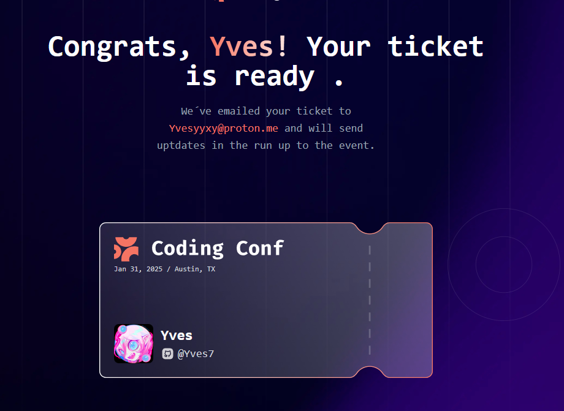
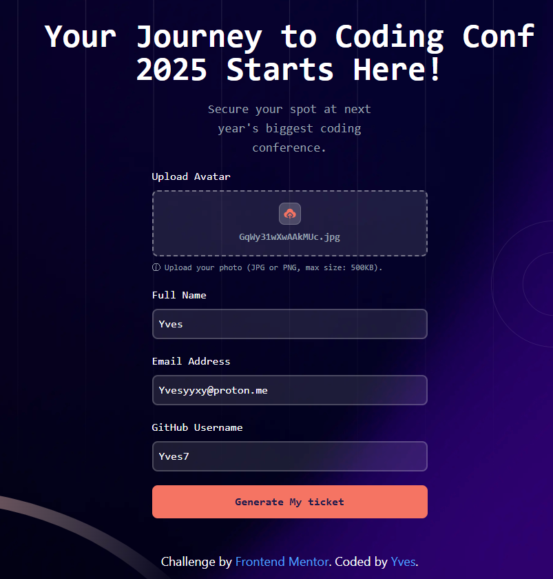

# Prueba en vivo

http://pawis7.github.io/TicketPage/

# ¿Qué hace?

Esta Pagina Genera tickets (no guarda datos en bd)

# ¿Cómo se hace?

Llena el formulario y obtendras tu ticket! no hay mas ciencia.

## The challenge (de donde saqué esto btw)

Thanks for checking out this front-end coding challenge.

[Frontend Mentor](https://www.frontendmentor.io) challenges help you improve your coding skills by building realistic projects.

Want some challenges? [Join our community](https://www.frontendmentor.io/community) and ask questions in the **#help** channel.

